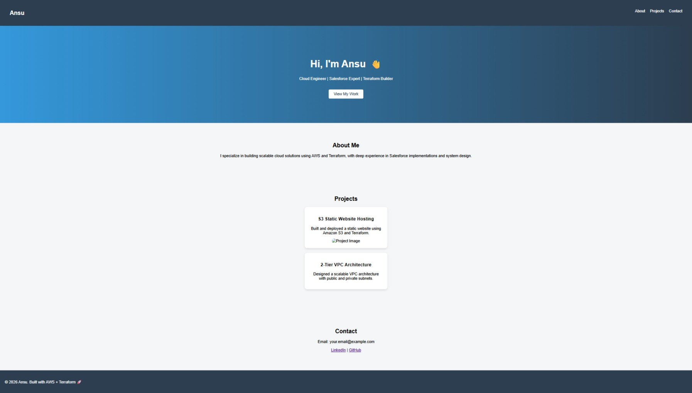
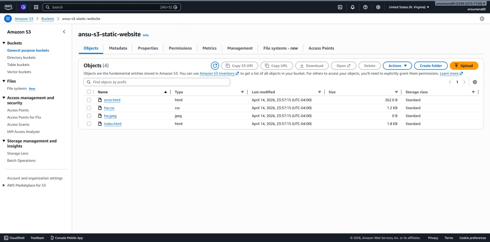
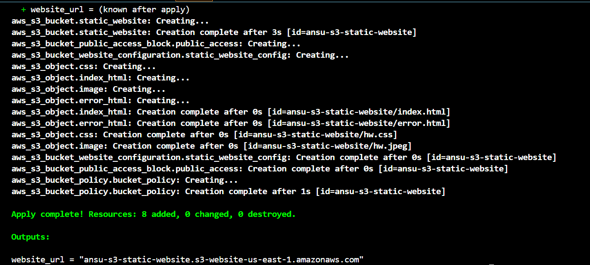

You’ve got an extra outer code fence and a mismatched closing fence. Replace your README with this cleaned version:

````md
# 🌐 S3 Static Website Hosting with Terraform

This project demonstrates how to host a static website using **Amazon S3** and provision infrastructure using **Terraform**.

---

## 🚀 Project Overview

This solution provisions an S3 bucket configured for static website hosting and deploys website assets (HTML, CSS, and images) automatically using Terraform.

The website is publicly accessible via the S3 static website endpoint.

---

## 🧰 Technologies Used

- AWS S3
- Terraform
- HTML / CSS

---

## 📁 Project Structure

```text
s3-static-website/
├── main.tf
├── variables.tf
├── providers.tf
├── outputs.tf
├── backend.tf
├── terraform.tfvars.example
├── README.md
├── screenshots/
│   ├── homepage.png
│   ├── s3-bucket.png
│   └── terraform-apply.png
└── website/
    ├── index.html
    ├── error.html
    ├── hw.css
    └── hw.jpeg
````

---

## ⚙️ Features

* ✅ Infrastructure as Code (Terraform)
* ✅ S3 static website hosting configuration
* ✅ Public access via bucket policy
* ✅ Automated upload of website files
* ✅ Output of website endpoint URL

---

## 🛠️ Setup Instructions

### 1. Clone the repository

```bash
git clone https://github.com/ansumana1980/s3-static-website-hosting.git
cd s3-static-website-hosting
```

---

### 2. Create your tfvars file

```bash
cp terraform.tfvars.example terraform.tfvars
```

Update the values:

```hcl
region      = "us-east-1"
environment = "dev"
bucket_name = "your-unique-bucket-name"
```

---

### 3. Initialize Terraform

```bash
terraform init
```

---

### 4. Review the execution plan

```bash
terraform plan
```

---

### 5. Apply the configuration

```bash
terraform apply
```

---

### 6. Access the Website

```bash
terraform output website_url
```

Open the URL in your browser.

---

## 🏗️ Architecture Diagram

```text
        User Browser
              │
              ▼
   S3 Static Website Endpoint
              │
              ▼
        Amazon S3 Bucket
   (HTML, CSS, Images hosted)
```

---

## 📸 Screenshots

### 🖥️ Website Homepage



---

### 📦 S3 Bucket Contents



---

### ⚙️ Terraform Apply Output



---

## ⚠️ Important Notes

* S3 bucket names must be globally unique
* Static website hosting requires public access
* Terraform state and `.terraform` files are excluded from version control

---

## 🔒 Future Enhancements

* Add CloudFront (HTTPS + CDN)
* Configure custom domain with Route 53
* Implement remote backend (S3 + DynamoDB)
* Add CI/CD pipeline for automated deployment

---

## 💬 Key Learnings

* Infrastructure provisioning using Terraform
* S3 static website hosting configuration
* Managing public access with bucket policies
* Structuring a clean and reusable cloud project

---

## ⭐️ Portfolio Summary

> Built and deployed a static website using Amazon S3 and Terraform, implementing infrastructure as code, automated asset deployment, and public access configuration.

---


